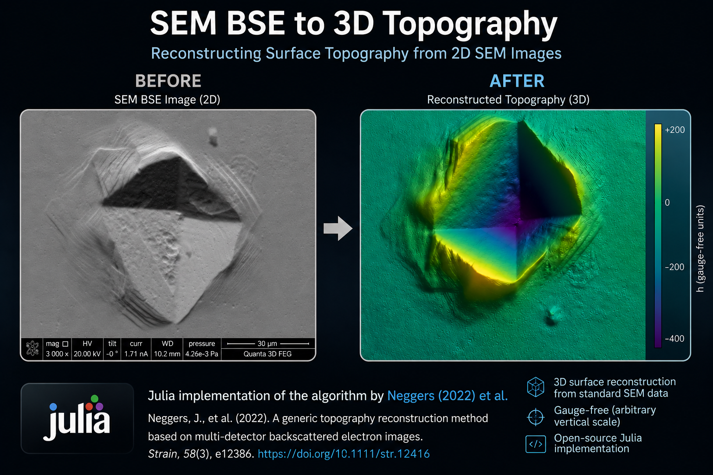

# TopoSEM.jl

Julia implementation of the BSE-image topography reconstruction algorithm
from Neggers et al., *A generic topography reconstruction method based on
multi-detector backscattered electron images*, **Strain** 58 (2022), e12416
([doi:10.1111/str.12416](https://doi.org/10.1111/str.12416)).



The package recovers a height map `h(x, y)` from `N ≥ 3` co-registered
BSE-detector images using the iterative photometric-stereo-style scheme of
Algorithm 1 of the paper (per-pixel gradient/curvature LSQ → Fourier
integration → per-detector parameter calibration, looped until convergence).

This repository is structured for **paper reproducibility**: a `Makefile`
regenerates every height map from the raw BSE images in `resources/` on
demand, and the rendered PNG previews of all 12 samples live under
`data/` (and are browseable straight on GitHub via the
[gallery](data/README.md)).

> The numerical reconstructions (`data/*_h.csv.gz`, ~40 MB total) are
> **not committed** — regenerate them with `make -k all` (≈ 30 min on
> a modern laptop). The `*_topography.png` previews and `*_meta.toml`
> sidecars **are** committed, so the gallery renders on GitHub without
> cloning.

## Quick start: browse the gallery

The fastest way to see what the algorithm produces on each sample is to
open [`data/README.md`](data/README.md) on GitHub — it embeds the 12
pre-rendered topography figures inline.

## Quick start: interactive 3D visualisation

```bash
git clone <repo-url>
cd TopoSEM.jl
make deps                # one-time setup (both Julia envs)
make -k all              # regenerate all 12 reconstructions (≈ 30 min)
make visualize           # interactive menu picker
```

The first time, `make -k all` is required because the height-map CSVs
are not shipped in the repo. After that the CSVs sit in `data/` and
`make visualize` opens immediately. `make visualize` prints a numbered
menu of all available samples, you type the index, and the script
opens a native OpenGL window (GLMakie) showing the pre-computed
topography. Drag = rotate, scroll = zoom, right-drag = pan, close the
window to exit.

```
$ make visualize
Available samples:
 1) jun_vickers          5) feb_S        9) may_crooked_60
 2) jun_sphere           6) feb_V       10) may_crooked_30
 3) jun_sphere_exp2      7) may_sphere
 4) feb_P                8) may_piezoceramic

Pick a sample number (q to quit): _
```

If you already know which sample you want, skip the menu entirely:

```bash
make visualize-jun_vickers          # direct shortcut, no menu
make visualize-jun_sphere
make visualize-feb_P
# … any sample name from the menu above
```

You can also call the underlying script with the sample as an argument
(equivalent to `make visualize-<sample>` but lets you bypass `make`):

```bash
julia --project=. examples/visualize.jl jun_vickers
```

## Regenerate from raw data

```bash
make deps        # instantiates both `.` (core) and `examples/` (Makie) envs
make -k all      # ≈ 20–30 min on a modern laptop — see -k note below
make figures     # render PNG heatmap + 3D-surface for every sample
make test        # 32 unit tests
make clean       # wipe data/*_h.csv.gz, *_meta.toml, *_topography.png
```

> **Use `make -k all`, not `make all`.** The `SAMPLES` list contains 12
> regular reconstructions plus one **intentionally-failing** experiment,
> `jun_sphere_exp3` (cubic detector response that diverges around iter
> ~100 — see [§ Polynomial-order observation](#polynomial-order-observation)
> for the why). Without `-k` (`--keep-going`), make stops at the first
> failure and the remaining samples never run. With `-k` the failure is
> isolated and the other 12 finish cleanly. Same applies to the per-sample
> shortcuts if you batch them: `make -k jun_vickers jun_sphere ...`.

`make <sample>` regenerates a single reconstruction (e.g. `make jun_vickers`).
Make tracks dependencies on `src/*.jl` and the per-sample script, so
editing the package source invalidates the affected CSVs automatically.

`make help` prints the full target list.

## Datasets

Ten 4-quadrant BSE acquisitions in `resources/` (with the SEM info-bar
overlay automatically detected and cropped):

| Sample              | Source                                       | Pixel size (μm/px)         | Calibration             |
|---------------------|----------------------------------------------|----------------------------|-------------------------|
| `jun_vickers`       | `Jun/pyramid/Q1..Q4.tif`                     | `10/96  ≈ 0.1042`          | `peak_to_trough = 6 μm` (Vickers indent depth) — `poly_order = 2` (default) |
| `jun_vickers_exp1`  | `Jun/pyramid/Q1..Q4.tif` (same input)        | `10/96  ≈ 0.1042`          | `peak_to_trough = 6 μm` — *cautionary experiment* with `poly_order = 1`, see "Polynomial-order observation" |
| `jun_sphere`        | `Jun/sphere/S1..S4.tif`                      | `20/44  ≈ 0.4545`          | `peak_to_trough = 130 μm` (dome height) — `poly_order = 1` |
| `jun_sphere_exp2`   | `Jun/sphere/S1..S4.tif` (same input)         | `20/44  ≈ 0.4545`          | `peak_to_trough = 130 μm` — *cautionary experiment* with `poly_order = 2`, see "Polynomial-order observation" |
| `feb_P`             | `Feb/PA, PB, PC, PD.tif`                     | `10/203 ≈ 0.0493`          | gauge-free |
| `feb_PR`            | `Feb/PRA, PRB, PRC, PRD.tif`                 | `30/308 ≈ 0.0974`          | gauge-free (crooked pyramid) |
| `feb_S`             | `Feb/SA, SB, SC, SD.tif`                     | `100/275 ≈ 0.3636`         | gauge-free |
| `feb_V`             | `Feb/VA, VB, VC, VD.tif`                     | `10/203 ≈ 0.0493`          | gauge-free (V-groove) |
| `may_sphere`        | `May/13.jpg, 16.jpg, 1.jpg, 4.jpg`           | `100/308 ≈ 0.3247`         | `peak_to_trough = 100 μm` (calibration sphere) |
| `may_piezoceramic`  | `May/34.jpg, 35.jpg, 26.jpg, 27.jpg`         | `10/171  ≈ 0.0585`         | gauge-free |
| `may_crooked_60`    | `May/45.jpg, 48.jpg, 39.jpg, 42.jpg`         | `30/308 ≈ 0.0974`          | gauge-free (crooked pyramid, 60° tilt) |
| `may_crooked_30`    | `May/46.jpg, 47.jpg, 40.jpg, 41.jpg`         | `30/308 ≈ 0.0974`          | gauge-free (crooked pyramid, 30° tilt) |

The pixel sizes are measured directly from the SEM scale bars embedded in
the images. The May series is grouped by **explicit file index** (taken
from the companion [`SurfaceTopography.jl`](https://github.com/.../SurfaceTopography)
project's sample list); files are loaded by `load_bse_images([...])`
rather than by regex glob since their numeric suffixes don't sort into the
desired (A, B, C, D) detector order.

The `peak_to_trough` calibration converts the gauge-free reconstruction
into physical micrometres by matching one feature of known dimension —
this is the **single optional calibration step** described in §4.3 of the
paper. Samples without such a reference are left gauge-free; their
relative shape is correct but the vertical scale is arbitrary.

## Repository layout

```
TopoSEM/
├── src/                    # Algorithm 1 implementation (TopoSEM Julia package)
├── test/                   # 32 unit tests (synthetic + I/O)
├── scripts/                # CSV-producing reconstruction scripts (`make all`)
│   ├── csv_io.jl                  shared gzipped-CSV / TOML helpers
│   ├── reconstruct_common.jl      shared pipeline (load → topo_sem → save)
│   └── reconstruct_<sample>.jl    one per sample
├── examples/               # thin loaders over data/ (no reconstruction here)
│   ├── visualize.jl               interactive 3D (GLMakie window)
│   └── render_static.jl           batch PNG (CairoMakie)
├── data/                   # reconstruction artefacts
│   ├── <sample>_h.csv.gz          gzipped CSV of the height matrix (regenerated, NOT committed)
│   ├── <sample>_meta.toml         pixel size, calibration, convergence log… (committed)
│   └── <sample>_topography.png    pre-rendered figure (committed)
├── resources/              # raw BSE TIFF acquisitions
├── Makefile                # `make all`, `make figures`, `make test`, …
├── Project.toml            # Julia dependencies
└── README.md               # this file
```

## Polynomial-order observation

Algorithm 1 in Neggers et al. 2022 leaves the polynomial order of the
detector response `φ` (Eq. 6) as a tunable parameter. Empirically, on the
samples shipped here:

- **`poly_order = 1` (linear φ)** is sufficient for *gentle-slope* samples
  (`feb_P`, `feb_S`, `feb_V`, `may_piezoceramic`, `may_*`) AND for the
  smooth `jun_sphere` dome: the iteration converges in ≤ 60 steps with
  `‖δh‖ → 0` and a clean reconstruction.
- **`poly_order = 1` is *not* sufficient for the Vickers indent
  (`jun_vickers`)**: the indent walls are essentially vertical, the
  linear φ cannot represent that, and even with 200 iterations the
  residual `‖δf‖` stops decreasing at a non-zero plateau leaving the
  walls visibly under-fit. This frozen experiment is shipped as the
  separate sample `jun_vickers_exp1` for direct visual contrast — run
  `make visualize` and pick `jun_vickers_exp1` to see the under-fit
  failure mode.
- **`poly_order = 2`** (quadratic `φ`) fixes `jun_vickers` cleanly — the
  indent walls and apex resolve correctly.
- **`poly_order = 2` BREAKS `jun_sphere`**, however. The smooth dome
  doesn't have enough nonlinear signal to constrain the extra quadratic
  coefficients, so the LSQ overfits and the reconstruction visually
  collapses into a pyramid-like shape with an asymmetric h range
  (`-38.6 … +91.4 μm` instead of the symmetric `-64 … +66 μm` from
  `poly_order = 1`). This frozen experiment is shipped as the separate
  sample `jun_sphere_exp2` for direct visual contrast — run
  `make visualize` and pick `jun_sphere_exp2` to see the failure mode.
- **`poly_order ≥ 3`** is currently unstable without explicit ridge
  regularisation in step C. Tested on the sphere as `jun_sphere_exp3`
  (script preserved in `scripts/`): with cubic φ the gauge drift
  compounds against the `u³`/`v³` monomials, the iterate explodes
  exponentially (`‖δh‖` jumps ten orders of magnitude per step around
  iter 105) and finally hits Inf/NaN in the step-C LU factorisation.
  The Make target therefore intentionally fails — this is a documented
  negative result, not a bug.

**Bottom line.** The package defaults to **`poly_order = 2`** in
`scripts/reconstruct_common.jl` — that's the right choice for most
samples. `jun_sphere` (the script) overrides back to `poly_order = 1`
because it is the only sample we have where the quadratic term is a net
loss. The right rule of thumb is: bump `poly_order` only if linear is
visibly under-fitting (steep walls, sharp transitions), and keep it at 1
for smooth surfaces.

## Output format

`data/<sample>_h.csv.gz` — gzipped CSV, no header, one matrix row per text
line, comma-separated, `%.6e` formatted Float64. Read in:
- Julia: `using CodecZlib, DelimitedFiles; readdlm(GzipDecompressorStream(open(path)), ',', Float64)`
- Python: `pandas.read_csv(path, compression="gzip", header=None)`
- NumPy: `np.loadtxt(gzip.open(path), delimiter=",")`

`data/<sample>_meta.toml` — sidecar TOML with `geometry.pixel_size_um`,
`calibration.method`, `calibration.scale_factor`, the full reconstruction
parameter set, convergence statistics and provenance (Julia version,
timestamp).

## Related projects

- [`vyastreb/sem2surface`](https://github.com/vyastreb/sem2surface) — a
  Python implementation of the earlier *principal-image-decomposition*
  BSE-topography algorithm by Neggers et al. (Ultramicroscopy **227**
  (2021), 113200, [doi:10.1016/j.ultramic.2020.113200](https://doi.org/10.1016/j.ultramic.2020.113200)).
  Useful as a reference point for the evolution of the approach.

## References

1. Neggers, J., Héripré, E., Bonnet, M., Hallais, S., & Roux, S. (2022).
   *A generic topography reconstruction method based on multi-detector
   backscattered electron images.* **Strain**, 58(4), e12416.
   DOI: [10.1111/str.12416](https://doi.org/10.1111/str.12416)

2. Neggers, J., Héripré, E., Bonnet, M., Boivin, D., Tanguy, A.,
   Hallais, S., Gaslain, F., Rouesne, E., & Roux, S. (2021).
   *Principal image decomposition for multi-detector backscatter
   electron topography reconstruction.* **Ultramicroscopy**, 227, 113200.
   DOI: [10.1016/j.ultramic.2020.113200](https://doi.org/10.1016/j.ultramic.2020.113200)

3. Frankot, R. T., & Chellappa, R. (1988). *A method for enforcing
   integrability in shape from shading algorithms.* **IEEE Transactions
   on Pattern Analysis and Machine Intelligence**, 10(4), 439–451.
   DOI: [10.1109/34.3909](https://doi.org/10.1109/34.3909)

## License

Code in this repository is licensed under the **GNU Affero General
Public License v3.0 or later** (AGPL-3.0-or-later); see the
[`LICENSE`](LICENSE) file for the full text.

The source paper (Neggers et al. 2022) is published under Creative
Commons Attribution-NonCommercial (CC-BY-NC) by Wiley; that licence
covers the article's text and figures, not this independent
reimplementation.
