# Reconstruction gallery

This directory hosts the per-sample reconstruction artefacts. Two of
the three pieces are committed; the third (the numerical height map)
is regenerable on demand:

| File                           | Committed? | How to obtain it                                |
|--------------------------------|:----------:|-------------------------------------------------|
| `<sample>_topography.png`      | ✅ yes     | rendered by `examples/render_static.jl` (`make figures`) |
| `<sample>_meta.toml`           | ✅ yes     | written by `scripts/reconstruct_<sample>.jl`    |
| `<sample>_h.csv.gz`            | ❌ no      | regenerate locally with `make <sample>` (or `make -k all` for all) |

The PNGs below are the same static renders surfaced by
`examples/render_static.jl`. For interactive 3D inspection (rotate,
zoom, pan) regenerate the CSVs first and then run
`make visualize-<sample>`.

For the full algorithm description, dataset table and machine-readable
file format see the [top-level README](../README.md).

---

## Vickers indent (`jun_vickers`)

Pyramidal Vickers indent. Calibrated to a peak-to-trough depth of 6 µm.
Default `poly_order = 2` resolves the steep walls cleanly.

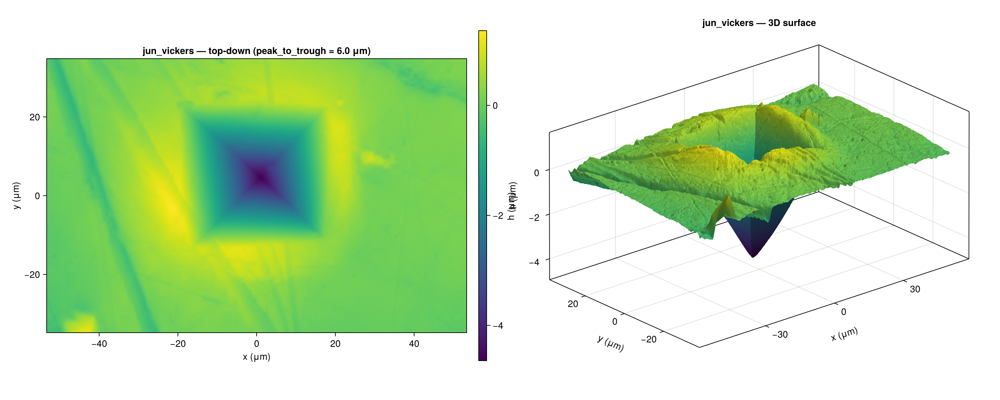

## Vickers indent — cautionary `poly_order = 1` (`jun_vickers_exp1`)

Same input as `jun_vickers` but forced to a linear detector response.
The walls and apex remain visibly under-fit — kept as a frozen
counterexample for direct visual contrast.

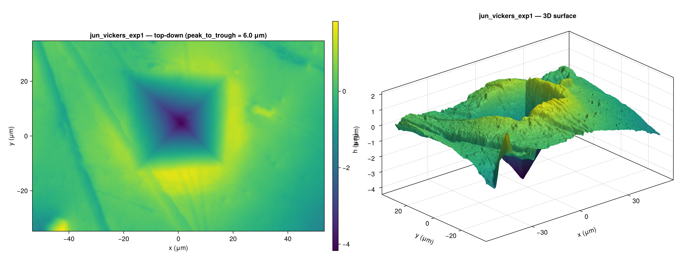

## Calibration sphere (`jun_sphere`)

Smooth dome calibrated to a peak-to-trough height of 130 µm. Overrides
the package default to `poly_order = 1` because a quadratic detector
response overfits this gentle surface.

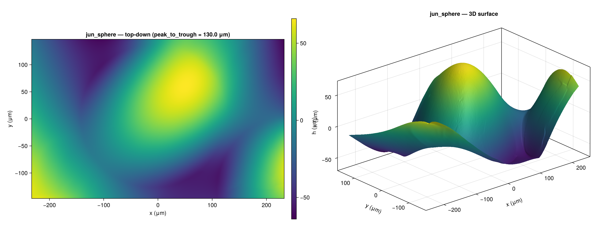

## Calibration sphere — cautionary `poly_order = 2` (`jun_sphere_exp2`)

Same dome reconstructed with the package default `poly_order = 2`.
The result visibly collapses into a pyramid-like shape with an
asymmetric height range — illustrates why smooth surfaces need a
linear response.

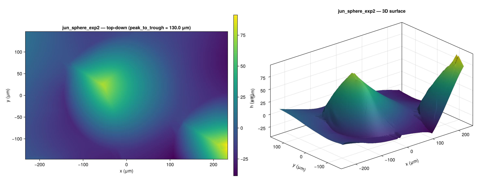

## Pyramid (`feb_P`)

Pyramid sample, gauge-free reconstruction.

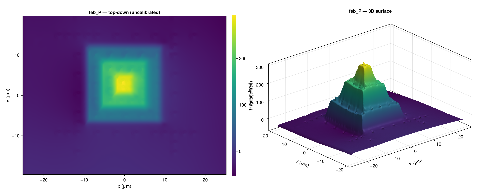

## Crooked pyramid (`feb_PR`)

Tilted pyramid sample, gauge-free.

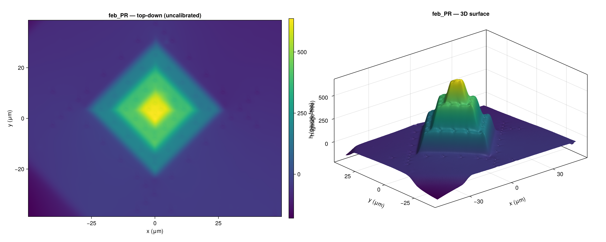

## Spherical sample (`feb_S`)

Gauge-free reconstruction of a spherical sample.

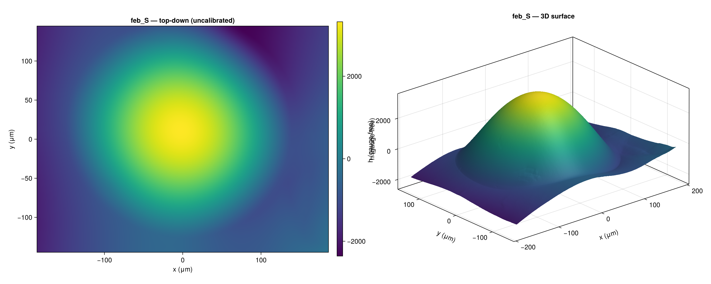

## V-groove (`feb_V`)

V-groove sample, gauge-free.

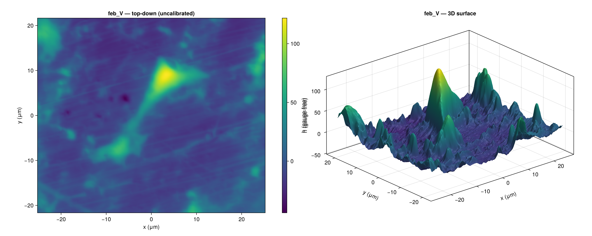

## Calibration sphere (`may_sphere`)

Calibration sphere, peak-to-trough = 100 µm.

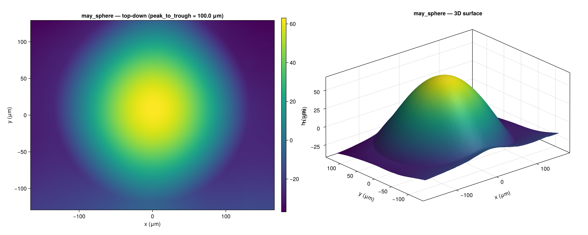

## Piezoceramic (`may_piezoceramic`)

Piezoceramic surface, gauge-free.

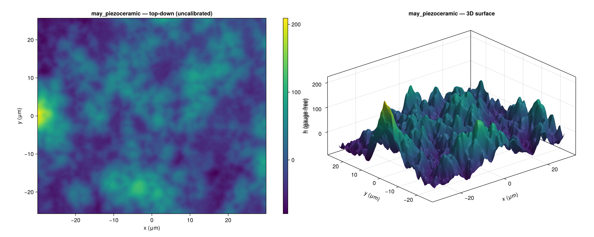

## Crooked pyramid, 60° tilt (`may_crooked_60`)

Crooked pyramid imaged at 60° tilt, gauge-free.

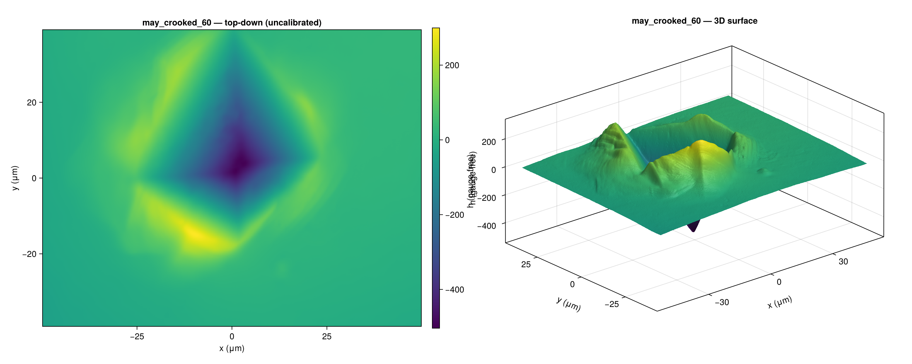

## Crooked pyramid, 30° tilt (`may_crooked_30`)

Same crooked pyramid imaged at 30° tilt, gauge-free.

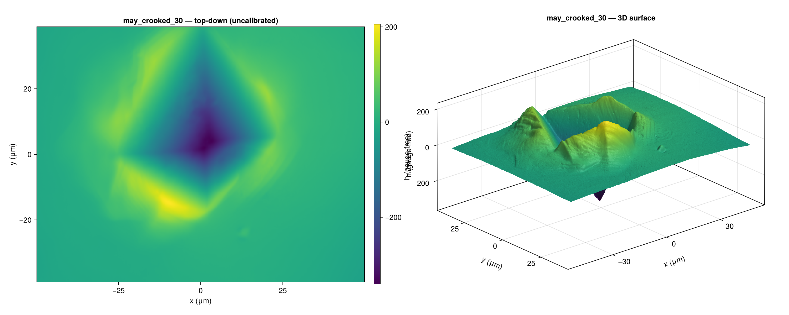
